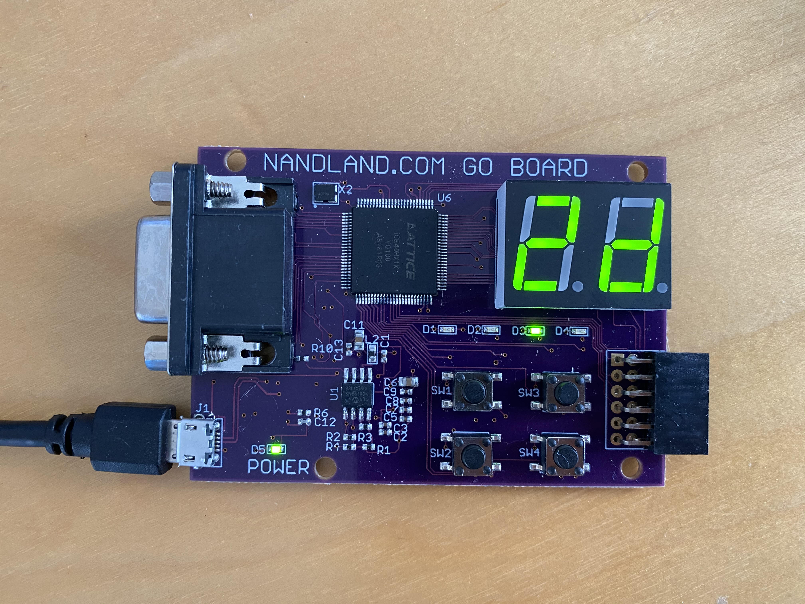
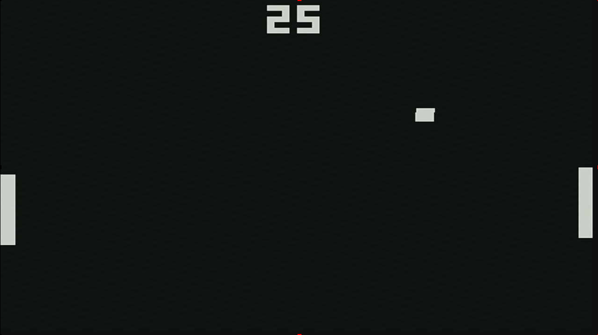

# Nandland Verilog Exercises

Working through the Nandland Verilog exercises for the Nandland Go Board

https://www.nandland.com/goboard/introduction.html

The YouTube Tutorials are a great way to work through the exercises:
https://www.youtube.com/playlist?list=PLnAoag7Ew-vr1M98Q5K2kLHxFQ5l0DU3B

# Requirements

- Nandland Go Board https://www.nandland.com/goboard/introduction.html

- ICECube2 IDE and Diamond Programmer
  https://www.nandland.com/goboard/setting-up-environment-icecube.html

# Exercises

## 1. Switches to LEDs

Connect switches on the GO Board directly to LEDs

## 2. AND gate

Use an AND gate 

## 3. Toggle LED when releasing switch

Using FlipFlops and Clock synchronisation to detect when switch one is released, and then toggle the state of an LED.

## 4. Debounce a Switch

Debouncing rapid 'bouncing' of a switch (when it is pressed or released) by using a counter to wait for it to stabilise in one state.

## 5. 7 Segment display

Press switch one to increment a counter which is displayed on a seven segment display.

## 6. Simulating LED Blinking Lights

Using the online EDAPlayground website to simulate a verilog circuit and visualise it, as if connecting a logic analyser to a physical circuit.

https://edaplayground.com/x/ATH

## 7. UART receiver

Receive characters over a serial connection

Works well with the TeraTerm application on Windows - remember to choose the right COM port for your GO Board and use settings:
- speed: 115200
- data: 8 bit
- parity: none
- stop bits: 1 bit
- flow control: none

When typing characters into the TeraTerm terminal, the 7-segment displays will show hex value of the character and the LEDS will show the character's low nibble. 

Note: characters will not appear in the TeraTerm terminal.

Note: have seen issues where Diamond programmer will fail while TeraTerm is connected.

UART recv simulation on EDAPlayground: 
https://edaplayground.com/x/NY8h

## 8. UART loopback

Receive characters over a serial connection and then send them back.

When typing charaters into the TeraTerm terminal, they will now also appear in the Terminal.

UART send simulation on EDAPlayground:
https://edaplayground.com/x/9pNH

UART recv->send simulation on EDAPlayground:
https://edaplayground.com/x/9pNH

## 9. VGA output

Use the first switch to cycle through a set of 9 VGA test patterns.

Connect a VGA monitor to the VGA output to see the test patterns.

The current test pattern selection is displayed on the 7 Segment display.

Developed + Simulated on EDAPlayground:
https://edaplayground.com/x/ahJE

## 10. PONG!

Simple implementation of the Pong game in verilog.

Connect a VGA monitor to the VGA output to see the display.

Player one uses switches on the left to move their paddle up and down.  Player two uses switches on the right.

Scores are displayed on the 7 segment displays on the board, and on screen.

The first player to 9 wins.

Connect via UART terminal (see project 7) to restart game by pressing any key in the teraterm terminal.

